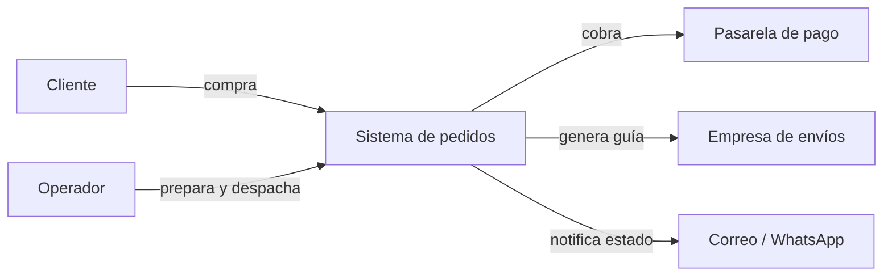
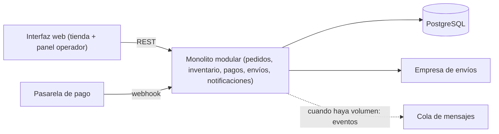
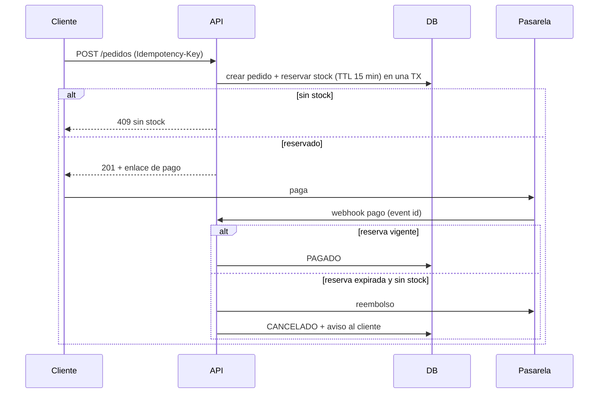

# Ejercicio 4: Pedidos de una tienda en línea

## 1. Objetivo, actores y alcance
**Objetivo:** controlar cada pedido desde que se confirma hasta que se despacha, sin vender stock inexistente ni perder pagos.

**Actores:** cliente (web y redes sociales), operador de bodega, pasarela de pago, empresa de envíos, administrador.

**Alcance:** pedido, pago, reserva de inventario, preparación, envío y seguimiento. **Fuera de alcance:** devoluciones, promociones y facturación electrónica (evolución futura).

## 2. Requisitos
**Funcionales:** RF1 crear pedido desde web/redes. RF2 reservar inventario. RF3 procesar pago. RF4 preparar y despachar. RF5 informar el estado al cliente. RF6 compensar fallos (liberar, reembolsar).

**Calidad:** consistencia del stock (no sobreventa), idempotencia, resiliencia a fallos de la pasarela, trazabilidad de estados, escalabilidad por componentes a futuro.

## 3. C4: Contexto

## 3b. C4: Contenedores

## 4. Flujo crítico: confirmar pedido

## 5. Decisiones
**¿Cuándo se reserva el inventario?** Al confirmar el pedido y **antes** de pagar, con vencimiento (TTL) de 15 minutos. Así dos clientes no pagan el mismo último artículo. Si el pago no llega a tiempo, la reserva se libera. El stock se descuenta definitivamente al despachar.

**Pago aprobado pero falla la reserva:** es una compensación (saga). Primero se intenta re-reservar; si no hay stock, se **reembolsa automáticamente**, se cancela el pedido y se avisa al cliente. Todo queda en la bitácora. Con la reserva previa al pago este caso es raro: solo ocurre si la reserva expiró.

**Informar al cliente:** estados claros (RESERVADO, PAGADO, EN_PREPARACION, DESPACHADO, CANCELADO), una página de seguimiento y notificación por correo/WhatsApp en cada cambio importante, con número de guía al despachar.

**Operaciones idempotentes:** crear pedido (Idempotency-Key), recepción del webhook de pago (id de evento único), reserva y liberación de stock (por id de pedido), reembolso (una vez por pedido), creación de guía de envío y envío de notificaciones.

**Componentes separables en el futuro:** pagos (por seguridad y riesgo), inventario (si se conectan varios canales/bodegas), notificaciones (carga asíncrona simple) y envíos (integración con terceros). Se dejan como módulos con interfaces claras.

## 6. Stack
Spring Boot o Node.js (según el equipo), PostgreSQL (transacciones para reserva y estados), API REST, interfaz web. Se incorpora mensajería (RabbitMQ) solo cuando haya tareas asíncronas o integraciones que lo justifiquen (notificaciones, envíos).

## 7. ADR
**ADR-001 (arquitectura): saga con reserva previa al pago y compensaciones.** *Decisión:* reservar con TTL, pagar y compensar con liberación o reembolso. *Consecuencias:* se evita la sobreventa y se pagan solo pedidos con stock; hay que gestionar la expiración y los estados intermedios.

**ADR-002 (tecnología): base de datos transaccional con reserva atómica, sin cola al inicio.** *Decisión:* comprobar disponibilidad y reservar en una sola transacción. *Consecuencias:* consistencia fuerte y simple; si el volumen crece, se añade cola de eventos y se separa inventario.

## 8. Riesgos
| Riesgo | Mitigación |
|---|---|
| Sobreventa entre web y redes | Reserva atómica en BD y stock único compartido |
| Webhook de pago duplicado o perdido | Idempotencia por id de evento y consulta periódica del estado a la pasarela |
| Reservas que nunca se liberan | TTL con liberación automática y alertas |

## 9. Métricas
**Negocio:** pedidos completados, cancelaciones y tiempo entre compra y despacho.
**Técnica:** errores de pago y webhooks duplicados ignorados (todas se ven en la pantalla).

## 10. Prototipo ejecutable e infraestructura como código
Para correr sin dependencias, el prototipo usa **Python (librería estándar) + SQLite**; el diseño objetivo conserva los mismos contratos. La pasarela de pago se simula con botones que llaman al webhook real.

| Archivo | Para qué sirve |
|---|---|
| `server.py` | API de pedidos, reserva con TTL, webhook idempotente, compensación, despacho |
| `index.html` | Tienda, seguimiento y panel del operador |
| `Dockerfile` | Imagen con healthcheck |
| `docker-compose.yml` | Servicio, puerto 8000, volumen y variable `RESERVATION_TTL` |
| `.github/workflows/ci.yml` | Construye y prueba `/api/health` en cada push |

**Ejecutar:** `docker compose up --build -d` y abrir el puerto 8000. **Reiniciar datos:** `docker compose down -v` (o el botón "Reiniciar demo").

**API:** `GET /api/products`, `POST /api/orders` (header `Idempotency-Key`), `GET /api/orders`, `POST /api/payments/webhook {event_id, order_id, status: approved|rejected}`, `POST /api/orders/{id}/advance`, `POST /api/orders/{id}/expire` (solo demo), `GET /api/audit|metrics|health`.

**Qué probar:** crea un pedido y pulsa "Pago aprobado", luego "Avanzar estado" hasta despachar (el stock baja); crea otro y pulsa "Pago rechazado" (la reserva se libera); crea otro, pulsa "Forzar expiración", y mientras tanto reserva todo el stock con otro pedido y luego pulsa "Llega pago aprobado (tarde)" para ver el reembolso automático; pulsa "Reenviar webhook duplicado" para ver la idempotencia.
